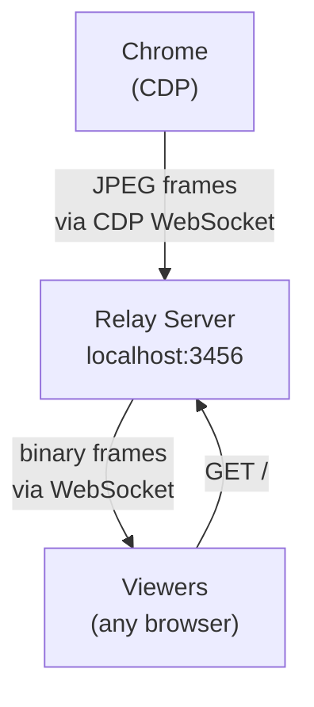

# screencast



No video encoding. No ffmpeg. Chrome sends JPEG frames via CDP, the relay forwards raw bytes over WebSocket. Viewers display frames in an `` tag. Sub-100ms latency.

## Prerequisites

- **agent-browser** CLI (used to open pages and interact with Chrome)
- **uv** (recommended) or Python 3.11+ with `websockets` installed

## Rules

- Do NOT manually search for Chrome, launch Chrome, or look for CDP ports. The scripts and agent-browser handle all of this.
- Do NOT try to expose the relay publicly (tailscale, localtunnel, ngrok, etc.) unless the user explicitly asks. The viewer URL is `http://localhost:3456`.
- Do NOT read or inspect `server.py` or `start-relay.sh`. Just run them.
- Do NOT chain commands with `&&` or `;` in any step. Run each step as its own Bash tool call.

## Steps

Follow these steps **in order**. Each step is a **separate** Bash tool call.

### Step 1 — Open the target page

```bash
AGENT_BROWSER_STREAM_PORT=9223 agent-browser open <URL>
```

Replace `<URL>` with the page the user wants to screencast.

### Step 2 — Start the relay

Run the start script. It backgrounds the server, waits for it to be healthy, and returns. **Do not add `&` or modify this command.**

```bash
bash <SKILL_DIR>/scripts/start-relay.sh <SKILL_DIR>
```

Replace `<SKILL_DIR>` with the absolute path to this skill's directory (the directory containing this SKILL.md).

Expected output: `Relay is running. Viewer URL: http://localhost:3456` followed by a JSON health response.

If it prints an error, read `/tmp/screencast-relay.log` for diagnostics.

### Step 3 — Push the first frame

Chrome only sends a frame when the page visually changes. Without this step, viewers see "waiting for frames...".

```bash
agent-browser eval "location.reload()"
```

### Step 4 — Share the viewer URL

Tell the user:

> Screencast is live at **http://localhost:3456**

That's it. Do not try to tunnel or expose publicly unless asked.

## Stop

```bash
pkill -f "server.py"
```

## Configuration

All via environment variables (set before the `bash start-relay.sh` command):

| Variable     | Default | Description                                                                                   |
| ------------ | ------- | --------------------------------------------------------------------------------------------- |
| `PORT`       | 3456    | HTTP/WS port for viewer connections                                                           |
| `CDP_URL`    | —       | Chrome CDP WebSocket URL (auto-discovered — rarely needed)                                    |
| `QUALITY`    | 40      | JPEG quality 1-100 (lower = faster FPS)                                                       |
| `MAX_WIDTH`  | 960     | Max frame width (lower = faster FPS)                                                          |
| `MAX_HEIGHT` | 540     | Max frame height (lower = faster FPS)                                                         |
| `EVERY_NTH`  | 1       | Send every Nth frame (1 = all)                                                                |
| `WATCH`      | —       | Directory to watch for file changes (auto-reloads browser). Auto-detected for `file://` URLs. |

## File Watching

When the browser is viewing a `file://` URL, the relay automatically watches that directory and reloads the browser on file changes. Override with `WATCH`:

```bash
WATCH=./my-site bash <SKILL_DIR>/scripts/start-relay.sh <SKILL_DIR>
```

## Sharing Publicly (only when asked)

**Tailscale Funnel** — Public HTTPS URL:

```bash
tailscale funnel 3456
# → https://<hostname>.<tailnet>.ts.net
```

**Tailscale Serve** — Tailnet only:

```bash
tailscale serve 3456
```

**Other options:**

- `ssh -R 80:localhost:3456 serveo.net`
- `npx wrangler@latest tunnel quick-start http://localhost:3456`
