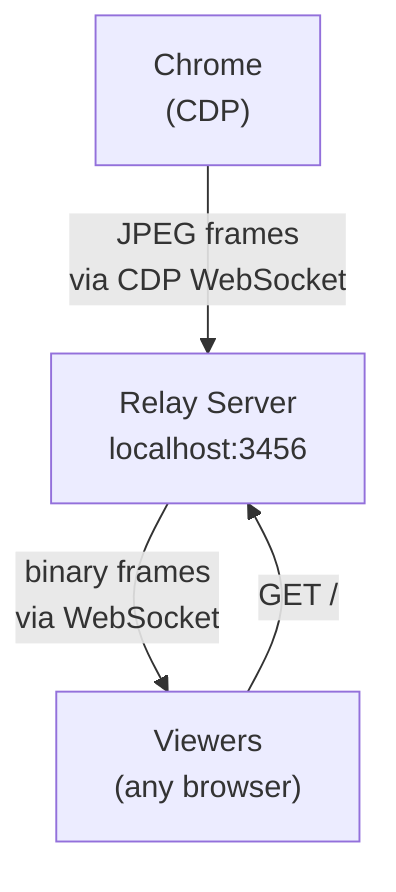

# screencast



No video encoding. No ffmpeg. Chrome sends JPEG frames via CDP, the relay forwards raw bytes over WebSocket. Viewers display frames in an `` tag. Sub-100ms latency.

## Prerequisites

- [**agent-browser**](https://github.com/vercel-labs/agent-browser) CLI (used to open pages and interact with Chrome)
- [**uv**](https://github.com/astral-sh/uv) to run the bundled Python relay script with its inline dependencies

## Available scripts

- [`scripts/start-relay.sh`](/skills/screencast/scripts/start-relay.sh) - Starts the relay in the background, waits for health, and prints the viewer URL plus JSON health output.
- [`scripts/server.py`](/skills/screencast/scripts/server.py) - Relay implementation. Run `uv run scripts/server.py --help` to inspect its interface when needed.

## Rules

- Do NOT manually search for Chrome, launch Chrome, or look for CDP ports. The scripts and agent-browser handle all of this.
- Do NOT try to expose the relay publicly (tailscale, localtunnel, ngrok, etc.) unless the user explicitly asks. The viewer URL is `http://localhost:3456`.
- Do NOT chain commands with `&&` or `;` in any step. Run each step as its own Bash tool call.

## Steps

Follow these steps **in order**. Each step is a **separate** Bash tool call.

### Step 0 — Clean slate

Always run these first to kill any leftover state from a previous session:

```bash
pkill -f "server.py" 2>/dev/null || true
```

```bash
agent-browser close 2>/dev/null || true
```

### Step 1 — Open the target page

```bash
AGENT_BROWSER_STREAM_PORT=9223 agent-browser open <URL>
```

Replace `<URL>` with the page the user wants to screencast.

### Step 2 — Start the relay

Run the start script **from the skill root directory** (use `cwd`). Do not run it via absolute path. Do not add `&` or modify this command.

```bash
bash scripts/start-relay.sh
```

If the user asked to watch a specific directory for live-reload, prefix with `WATCH`:

```bash
WATCH=./demo bash scripts/start-relay.sh
```

For `file://` pages, `WATCH` is optional — the relay auto-detects the directory.

Expected output: `Relay is running. Viewer URL: http://localhost:3456` followed by a JSON health response.

If it prints an error, read `/tmp/screencast-relay.log` for diagnostics.

### Step 3 — Verify

Run a health check:

```bash
curl -s http://localhost:3456/health
```

Expected: JSON with `"status":"ok"` and `frames` > `0`.

If `frames` is `0`, reload and re-check:

```bash
agent-browser eval "location.reload()"
```

Then take a screenshot of the **target page** to confirm it rendered:

```bash
agent-browser screenshot /tmp/screencast-verify.png
```

> **IMPORTANT:** Do NOT open `http://localhost:3456` in agent-browser to verify.
> That navigates the screencasted browser **away** from the target page, which
> breaks the screencast (frames freeze) and disables file watching for `file://`
> URLs. Always verify by screenshotting the target page or by curling `/health`.

### Step 4 — Share the viewer URL

**You MUST share the viewer URL with the user before doing anything else.** Do not skip this step.

> Screencast is live at **http://localhost:3456**
>
> Let me know if you want a tunneled URL you can share with others!

### Step 5 — Public sharing (only when asked)

The local relay must already be running first (Steps 1-4).

**Step 5a** — Check what package runners and tunnel tools exist. Run each as a separate call:

```bash
which bun 2>/dev/null
```

```bash
which npx 2>/dev/null
```

```bash
which pnpm 2>/dev/null
```

```bash
which tailscale 2>/dev/null
```

**Step 5b** — Use the **first available** option from this list. Do NOT skip ahead.

1. **If `bun`, `npx`, or `pnpm` is available → Wrangler quick tunnel** (preferred — ephemeral, no identity exposure):

   > The Bash tool cannot run `&` and wrangler tunnels block forever.
   > **Tell the user the exact command to run themselves.** Do NOT run it in Bash.

   Give them the command for whichever runner was found (`bun` > `npx` > `pnpm dlx`):

   ```
   bun wrangler tunnel quick-start http://localhost:3456 &
   # or: npx wrangler@latest tunnel quick-start http://localhost:3456 &
   # or: pnpm dlx wrangler tunnel quick-start http://localhost:3456 &
   ```

2. **Only if none of bun/npx/pnpm exist → Tailscale Serve** (tailnet-only, safe to run in Bash):

   ```bash
   tailscale serve --bg 3456
   ```

3. **Only if user explicitly wants a public URL and wrangler is unavailable → Tailscale Funnel** (public HTTPS, exposes tailnet identity, safe to run in Bash):

   ```bash
   tailscale funnel --bg --yes 3456
   tailscale funnel status
   ```

Include both the local and public/tunneled URLs in your response.

## Stop

```bash
pkill -f "server.py"
```

```bash
agent-browser close
```

## Configuration

All via environment variables (set before the `bash start-relay.sh` command):

| Variable               | Default   | Description                                                                                   |
| ---------------------- | --------- | --------------------------------------------------------------------------------------------- |
| `PORT`                 | 3456      | HTTP/WS port for viewer connections                                                           |
| `BIND_HOST`            | 127.0.0.1 | Bind host for relay HTTP/WS server. Keep local-only unless explicitly asked to expose LAN.    |
| `CDP_URL`              | —         | Chrome CDP WebSocket URL (auto-discovered — rarely needed)                                    |
| `QUALITY`              | 40        | JPEG quality 1-100 (lower = faster FPS)                                                       |
| `MAX_WIDTH`            | 960       | Max frame width (lower = faster FPS)                                                          |
| `MAX_HEIGHT`           | 540       | Max frame height (lower = faster FPS)                                                         |
| `EVERY_NTH`            | 1         | Send every Nth frame (1 = all)                                                                |
| `WATCH`                | —         | Directory to watch for file changes (auto-reloads browser). Auto-detected for `file://` URLs. |
| `IDLE_TIMEOUT`         | 1800      | Auto-shutdown after N seconds of inactivity (frames/viewers). `0` = disabled.                 |
| `FORCE_INITIAL_RELOAD` | 1         | Set to `0` to skip the automatic first-frame reload in `start-relay.sh`.                      |

## File Watching

When the browser is viewing a `file://` URL, the relay automatically watches that directory and reloads the browser on file changes. Use `WATCH` when the user explicitly asks to watch a different directory:

```bash
WATCH=./my-site bash scripts/start-relay.sh
```

After starting the relay, edit a file in that directory and then check:

```bash
curl -s http://localhost:3456/health
```

The screencast should remain healthy and continue serving frames.

## Sharing Publicly (reference)

See Step 5 for the full decision tree. Quick reference in priority order:

| Method                | Privacy                  | Agent can run? | Command                                                   |
| --------------------- | ------------------------ | -------------- | --------------------------------------------------------- |
| Wrangler quick tunnel | Ephemeral, no identity   | ❌ Tell user   | `bun wrangler tunnel quick-start http://localhost:3456 &` |
| Tailscale Serve       | Tailnet-only             | ✅             | `tailscale serve --bg 3456`                               |
| Tailscale Funnel      | Public, exposes identity | ✅             | `tailscale funnel --bg --yes 3456`                        |
