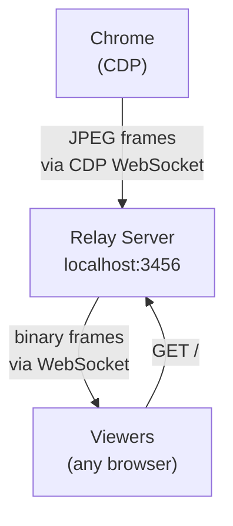

# screencast



No video encoding. No ffmpeg. Chrome sends JPEG frames via CDP, the relay forwards raw bytes over WebSocket. Viewers display frames in an `` tag. Sub-100ms latency.

## Prerequisites

- **agent-browser** CLI (used to open pages and interact with Chrome)
- **uv** to run the bundled Python relay script with its inline dependencies

## Available scripts

- `scripts/start-relay.sh` - Starts the relay in the background, waits for health, and prints the viewer URL plus JSON health output.
- `scripts/server.py` - Relay implementation. Run `uv run scripts/server.py --help` to inspect its interface when needed.

## Rules

- Do NOT manually search for Chrome, launch Chrome, or look for CDP ports. The scripts and agent-browser handle all of this.
- Do NOT try to expose the relay publicly (tailscale, localtunnel, ngrok, etc.) unless the user explicitly asks. The viewer URL is `http://localhost:3456`.
- Do NOT chain commands with `&&` or `;` in any step. Run each step as its own Bash tool call.

## Steps

Follow these steps **in order**. Each step is a **separate** Bash tool call.

### Choose the Step 2 command first

If the user asked for watched local files, use `WATCH` in Step 2:

```bash
WATCH=./demo bash scripts/start-relay.sh
```

Otherwise use:

```bash
bash scripts/start-relay.sh
```

For `file://` pages, WATCH is optional because the relay auto-detects the directory.

### Step 1 — Open the target page

```bash
AGENT_BROWSER_STREAM_PORT=9223 agent-browser open <URL>
```

Replace `<URL>` with the page the user wants to screencast.

### Step 2 — Start the relay

Run the start script from the skill root. It backgrounds the server, verifies prerequisites, waits for health, triggers an initial page reload, and returns. **Do not add `&` or modify this command.**

```bash
bash scripts/start-relay.sh
```

Expected output: `Relay is running. Viewer URL: http://localhost:3456` followed by a JSON health response.

If it prints an error, read `/tmp/screencast-relay.log` for diagnostics.

### Step 3 — Verify the relay is receiving frames

Run a health check before telling the user the screencast is live:

```bash
curl -s http://localhost:3456/health
```

Expected result: JSON with `"status":"ok"` and `frames` greater than `0`.

If `frames` is still `0`, run:

```bash
agent-browser eval "location.reload()"
```

Then check health once more.

### Step 4 — Share the viewer URL

Tell the user:

> Screencast is live at **http://localhost:3456**

That's it for local sharing.

### Step 5 — Public sharing (only when asked)

The local relay must already be running first (Steps 1-4). If the user asked for a link to view the screencast:

_cruical_: make sure to not foreground these commands as they can block your workflow indefinitely. Use `--bg` for tailscale funnel/serve. Use `npx wrangler@latest tunnel quick-start <url> &` which backgrounds by default.

- share the localhost URL: `http://localhost:3456` and tell them about `tailscale serve/funnel` and `npx wrangler@latest tunnel quick-start http://localhost:3456` for public sharing options.
- if they explicitly ask you to expose the screencast publicly, check if `npm`/`bun`/`pnpm` are available:
  - if yes, use `npx wrangler@latest tunnel quick-start http://localhost:3456` and share the returned public URL.
  - if no, check if `tailscale` is available:
    - if yes, start with `tailscale serve http://localhost:3456` (Tailnet-only sharing) and share the returned URL.
      - if they want a public HTTPS URL, switch to `tailscale funnel --bg --yes http://localhost:3456` and share that URL instead.
    - if no, share the localhost URL and tell them to use their own tunneling solution (e.g., `ssh -R`, `localtunnel`, `ngrok`, etc.) to expose it.

Use the `https://...ts.net` URL from status output as the public viewer URL.

In the final response include both URLs:

1. Local viewer URL: `http://localhost:3456`
2. Public URL returned by Funnel

If the user requests a different public method, only then use one from the sharing section.

## Stop

```bash
pkill -f "server.py"
```

## Configuration

All via environment variables (set before the `bash start-relay.sh` command):

| Variable               | Default   | Description                                                                                   |
| ---------------------- | --------- | --------------------------------------------------------------------------------------------- |
| `PORT`                 | 3456      | HTTP/WS port for viewer connections                                                           |
| `BIND_HOST`            | 127.0.0.1 | Bind host for relay HTTP/WS server. Keep local-only unless explicitly asked to expose LAN.    |
| `CDP_URL`              | —         | Chrome CDP WebSocket URL (auto-discovered — rarely needed)                                    |
| `QUALITY`              | 40        | JPEG quality 1-100 (lower = faster FPS)                                                       |
| `MAX_WIDTH`            | 960       | Max frame width (lower = faster FPS)                                                          |
| `MAX_HEIGHT`           | 540       | Max frame height (lower = faster FPS)                                                         |
| `EVERY_NTH`            | 1         | Send every Nth frame (1 = all)                                                                |
| `WATCH`                | —         | Directory to watch for file changes (auto-reloads browser). Auto-detected for `file://` URLs. |
| `FORCE_INITIAL_RELOAD` | 1         | Set to `0` to skip the automatic first-frame reload in `start-relay.sh`.                      |

## File Watching

When the browser is viewing a `file://` URL, the relay automatically watches that directory and reloads the browser on file changes. Use `WATCH` when the user explicitly asks to watch a different directory:

```bash
WATCH=./my-site bash scripts/start-relay.sh
```

After starting the relay, edit a file in that directory and then check:

```bash
curl -s http://localhost:3456/health
```

The screencast should remain healthy and continue serving frames.

## Sharing Publicly (only when asked)

**CF Quick Tunnel** — Public HTTPS URL:

```bash
npx wrangler@latest tunnel quick-start http://localhost:3456 &
```

**Tailscale Funnel** — Public HTTPS URL:

```bash
tailscale funnel --bg --yes 3456
tailscale funnel status
```

**Tailscale Serve** — Tailnet only:

```bash
tailscale serve 3456 --bg
```

**Other options:**

- `ssh -R 80:localhost:3456 serveo.net`
- `npx wrangler@latest tunnel quick-start http://localhost:3456`
