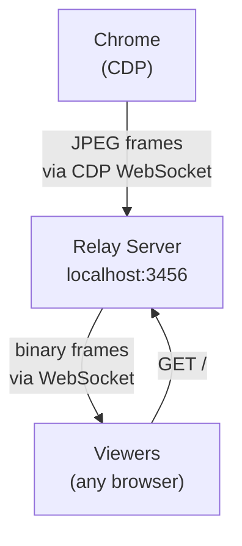

# screencast



No video encoding. No ffmpeg. Chrome sends JPEG frames via CDP, the relay forwards raw bytes over WebSocket. Viewers display frames in an `` tag. Sub-100ms latency.

Live-stream your browser to a shareable URL. Connects to Chrome via CDP, relays screencast frames over WebSocket to any number of viewers.

## Prerequisites

- **agent-browser** CLI (used to open pages and interact with Chrome)
- **uv** (recommended) or Python 3.11+ with `websockets` installed

## Do NOT

- Do NOT manually search for Chrome, launch Chrome, or look for CDP ports. The relay script and agent-browser handle all of this.
- Do NOT try to expose the relay publicly (tailscale, localtunnel, ngrok, etc.) unless the user explicitly asks. The viewer URL is `http://localhost:3456`.
- Do NOT read or inspect `server.py`. Just run it.

## Steps

Follow these steps **in order**. Do not skip or reorder.

### 1. Open the target page

```bash
agent-browser open <url>
```

Replace `<url>` with the page the user wants to screencast (can be `https://...` or `file:///...`).

### 2. Start the relay

The script auto-discovers the CDP connection from agent-browser. Do not pass a CDP URL manually.

Run `scripts/server.py` (relative to this skill's directory) with `uv run`:

```bash
PYTHONUNBUFFERED=1 uv run <SKILL_DIR>/scripts/server.py > /tmp/screencast-relay.log 2>&1 &
```

Replace `<SKILL_DIR>` with the absolute path to this skill's directory (the directory containing this SKILL.md).

### 3. Verify the relay is running

```bash
sleep 3 && curl -s http://localhost:3456/health
```

Expected: `{"status":"ok", ...}`

### 4. Reload the page to push the first frame

Chrome only sends a frame when the page visually changes. Without this step, viewers see "waiting for frames...".

```bash
agent-browser eval "location.reload()"
```

### 5. Share the viewer URL

Tell the user:

> Screencast is live at **http://localhost:3456**

That's it. Do not try to tunnel or expose publicly unless asked.

## Stop

```bash
pkill -f "server.py"
```

## Configuration

All via environment variables (set before the `uv run` command):

| Variable     | Default | Description                                                                                   |
| ------------ | ------- | --------------------------------------------------------------------------------------------- |
| `PORT`       | 3456    | HTTP/WS port for viewer connections                                                           |
| `CDP_URL`    | —       | Chrome CDP WebSocket URL (auto-discovered — rarely needed)                                    |
| `QUALITY`    | 60      | JPEG quality 1-100                                                                            |
| `MAX_WIDTH`  | 1280    | Max frame width                                                                               |
| `MAX_HEIGHT` | 720     | Max frame height                                                                              |
| `EVERY_NTH`  | 1       | Send every Nth frame (1 = all)                                                                |
| `WATCH`      | —       | Directory to watch for file changes (auto-reloads browser). Auto-detected for `file://` URLs. |

## File Watching

When the browser is viewing a `file://` URL, the relay automatically watches that directory and reloads the browser on file changes. Override with `WATCH`:

```bash
WATCH=./my-site PYTHONUNBUFFERED=1 uv run <SKILL_DIR>/scripts/server.py > /tmp/screencast-relay.log 2>&1 &
```

## Sharing Publicly (only when asked)

**Tailscale Funnel** — Public HTTPS URL:

```bash
tailscale funnel 3456
# → https://<hostname>.<tailnet>.ts.net
```

**Tailscale Serve** — Tailnet only:

```bash
tailscale serve 3456
```

**Other options:**

- `ssh -R 80:localhost:3456 serveo.net`
- `npx wrangler@latest tunnel quick-start http://localhost:3456`
